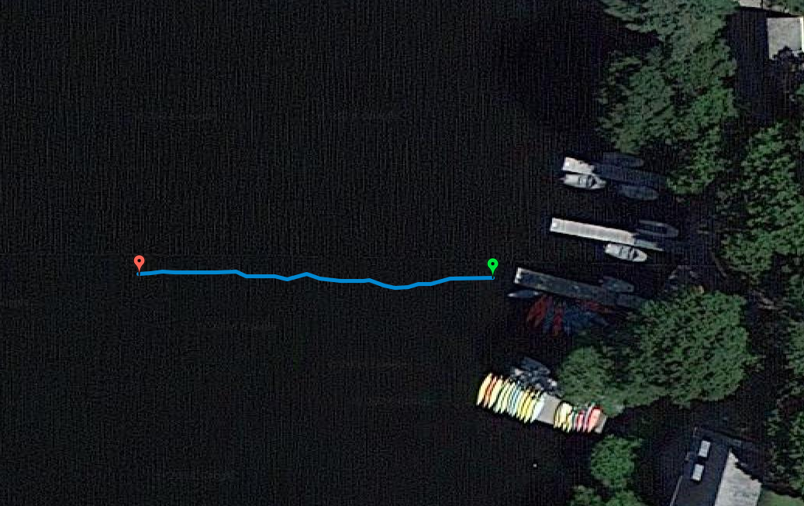
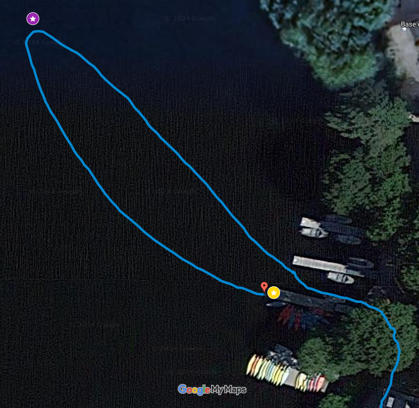
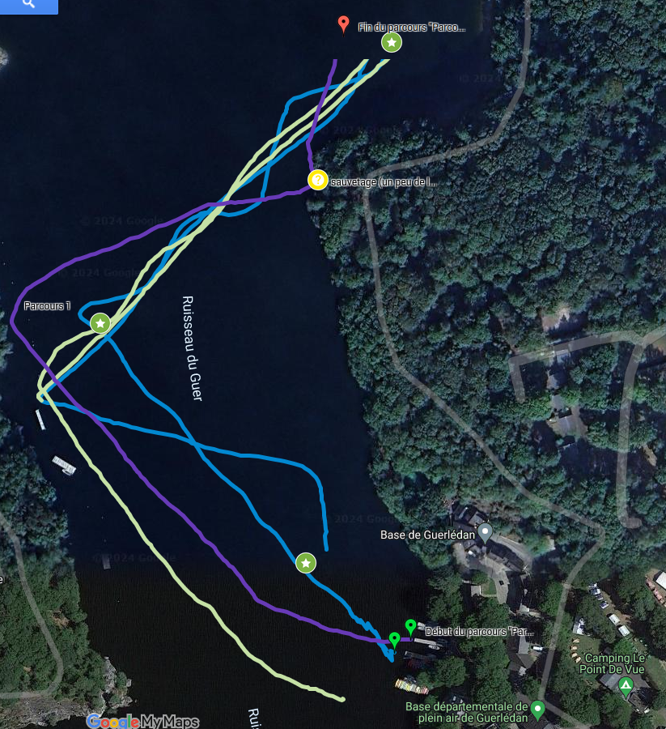
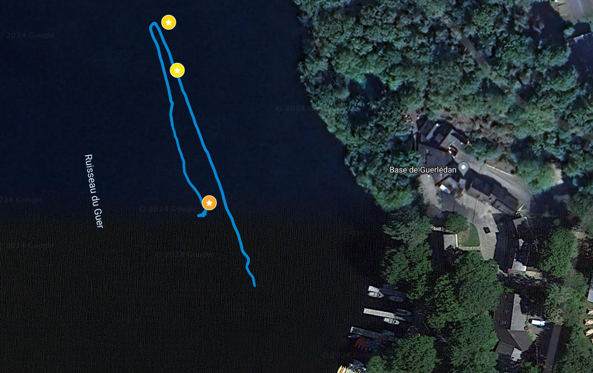

# Guerlédan - Reymanta

## Description
Projet Guerlédan septembre 2024.
Composition du groupe : Emma, Rémi et Yasmine.
Nom de groupe : reymanta


# Fichiers
Les résultats des différentes missions (photos, vidéos, relevés GPS, affichage maps) sont chacun dans un dossier numéroté.

## Nos différents fichiers python
* **calibration.py** : C'est la première fonction que l'on nous a demandé de coder, elle permet de calibrer l'accéléromètre et le magnétomètre pour repérer le bateau dans l'espace (i.e. donner des références aux capteurs proprioceptifs). Pour cela, elle prend en compte des points de références (les valeurs prises sur les points cardinaux et les orientations par exemple) puis corrige les mesures pour renvoyer les angles d'Euler du bateau et pas seulement de l'IMU. 
* **cap_ouest.py** : Son but est de suivre un cap et enregistrer les données GPS dans un log (pour la mission 1). Le programme extrait les données GPS, les convertit et modifie le cap du bateau pour aller dans la direction souhaitée. 
* **sens_imu.py** : Son exécution permet de tester si l'IMU fonctionne correctement (par exemple lorsqu'on commence à avoir des valeurs aberrantes/ qui ne bougent plus)
* **analyse_gps.py** : Le programme convertit les données GPS du log (fichier txt) en données GPX automatiquement pour tous les fichiers txt du dossier. Une option existe pour ne traiter que les fichiers d'une certaine longueur. 
* **stop.py** : Fonction très simple qui permet d'arrêter complètement les moteurs du bateau.
* **test_lissajou.py** : C'est un fichier pour afficher le tracé des fonctions lissajou grâce à matplotlib. Elle est notamment utile pour vérifier les équations/ les paramètres d'entrée lors des exécutions. 
* **main.py** : Ce fichier contient tous les codes des missions 2, 3, 4 et 5. C'est d'ici que l'on lance les programmes servant aux différentes missions. Le fichier contient par ailleurs les différentes fonctions que doit exécuter notre bateau pour ses différentes escpades lacustres (suivre un cap fixe, suivre une ligne, suivre une liste de waypoints, lissajou etc...).

# Déroulé de la semaine

## Jour 1 : Suivi de cap
   Le premier jour, il nous a d'abord fallu calibrer l'accéléromètre ainsi que le magnétomètre (création du fichier calibration.py). Une fois avoir testé à l'extérieur que le DDboat était bien calibré, nous avons pu passer à la mission du jour qui consistait à suivre le cap ouest pendant 30 secondes. Après quelques essais infructueux nous avons tout de même réussi à passer ce défi peu avant manger. 
   Cela nous a permis d'en apprendre un peu plus sur le protocole à exécuter avant chaque mise à l'eau (tester à l'air libre, vérifier les fautes de frappes etc...) pour être plus efficaces sur les prochains jours. Nous avons aussi pris un soin particulier à rendre la procédure de calibration très efficace pour anticiper pour les jours suivants (ce qui a été par ailleurs assez utile ensuite). 
   Nous avons aussi réussi à récupérer les logs dans un fichier texte, que nous avons traité comme le vendredi précédent sur le stade. Avec le fichier .gpx obtenu à cette issue, nous avons pu afficher le trajet du ddboat sur Google Maps pour prouver le bon déroulement de la mission. 




## Jour 2 : Rejoindre un waypoint
Nous avons eu un cours sur comment rejoindre un waypoint, et notamment la conversion des coordonnées sphériques (latitude/longitude) en coordonnées cartésiennes dans le plan du lac (avec un point du ponton comme origine).  
Les différents problèmes que nous avons rencontrés dans la journée ont été :  
* l'oubli de la conversion des angles des degrés en radians pour les fonctions trigonométriques malgré que nos corrections de cap soient en degré. 
* le GPS est en NED (et les coordonnées classiques dans Google Maps par exemple) alors que nos équations étaient dans un repère avec les coordonées en Ouest positives, il fallait donc veiller à hanger les bons signes.  
L'image ci-dessous montre le trajet du bateau, qui a fait un suivi de cap jusqu'à la bouée avant de revenir au ponton (validation de la bouée quand le ddboat était dans un rayon de 5m de la bouée).



## Jour 3 : Suivi de trajectoire (navigation)
Nous avons commencé par travailler sur le programme du lissajou. Après avoir testé si nous avions bien la bonne fonction en faisant une rapide simulation sous matplotlib, nous avons commencé à travailler sur le code.
Nous l'avons d'abord testé une première fois, le bateau semblait décrire la bonne courbe, seulement, il était plus pratique de changer l'orientation de la courbe en mettant son axe principal sur l'axe nord-sud. Donc nous avons essayé de le modifier, mais peu de temps après notre IMU a soudainement pris l'eau. Il nous a fallu quelques temps avant de nous en rendre compte (le suivi de waypoints ne marchait plus du tout, et avec la fonction verif_gps(), nous avons réalisé qu'il nous renvoyait toujours la même valeur).
Nous avons commencé par sécher l'IMU, mais rien n'y fit, elle était vraiment endommagée, donc nous avons dû la remplacer et recommencer les calibrations.
Nous avons malheureusement perdu beaucoup de temps sur notre journée, et au final notre lissajou n'a pas vraiment fonctionné. Le temps que nous avons passé le lendemain pour améliorer le programme n'a pas apporté de meilleures solutions non plus. 
## Jour 4 : Suivi de ligne (guidage)
Le matin, nous avons eu un cours sur le suivi de ligne, pour éviter le phénomène de la courbe du chien. La première mission du jour consistait en : aller jusqu'à la bouée et continuer avec le même cap pendant 2 min (que nous avons raccourci à 1min30 sous les conseils d'un groupe précédent). Voici le log de ce trajet :


Pour l'après-midi, nous avons récupéré les coordonnées GPS de 3 bouées, et l'objectif était de passer par chaque bouée et de revenir. Notre bateau devait effectuer ainsi une boucle de quelques centaines de mètres. Il devait suivre ce parcours avec la fonction suivi de ligne qui nous avait été présenté en cours précédement et continuer ad vitam eternam jusqu'à épuisement des batteries. 
Nous avons donc fait un suivi de waypoints en suivant à chaque fois la ligne imaginaire entre deux bouées (fonction suivi_ligne() dans le fichier main.py). Chaque waypoint serait validé soit quand le ddboat entre dans la zone à moins de 5m de la bouée, soit lorsqu'il franchit le plan perpendiculaire à la ligne tracée entre sa bouée de départ et sa bouée d'arrivée.
L'image ci dessous montre les (presque) 3 aller-retours accomplis par le ddboat :



Le premier aller-retour correspond à la ligne bleue. Nous avons vite remarqué que plus le bateau avançait, plus il faisait de grandes oscillations au lieu de suivre la ligne de façon droite.
Lors du deuxième aller-retour, nous avons donc réduit le coefficient devant l'erreur de cap calculée en fonction de l'écart à la ligne, afin de rendre son influence plus faible par rapport au cap initial. Cela a en effet permis de réduire les oscillations, on peut le voir sur la ligne verte, qui correspond au second trajet.
Enfin, pour le troisème trajet, nous avons essayé d'augmenter les vitesses des moteurs (avec un offset de 120 au lieu de 80) à la demande de M. Jaulin pour rattraper le groupe qui croisait devant nous.
Cette fois ci, il n'a fait qu'un aller, car il a manqué de batterie au milieu du trajet.
Pour éviter les oscillations, nous nous sommes après coup dit que nous aurions pu relancer à zéro à chaque bouée atteinte, ce qui aurait ainsi peut être pu éviter d'avoir d'aussi grandes oscillations après plusieurs waypoints, car on peut voir que la première ligne suivie n'engendre pas des oscillations trop importantes. 

## Jour 5 : Différentes zones
Pour cette mission, il nous fallait être à au moins plus de 25m de la bouée A avant une certaine heure, puis entrer dans la zone, et atteindre la bouée et y rester exactement 2 minutes après.
Pour ce faire, nous avons décidé de faire un suivi de waypoints, en définissant 2 autres points : l'un hors de la zone, et un second à environ 10m de la bouée, et de lancer les départs en différé en fonction de l'heure demandée. 
Cependant, au moment de tester notre code, nous avons commencé à avoir des problèmes avec notre suivi de waypoints, que nous avons mis du temps à régler, et lors du départ, nous avons par inattention mal changé l'horaire de départ, ce qui fait que notre ddboat n'a pas pu partir avec les autres. A noter qu'il serait parfaitement parti une petite demi-heure plus tard comme indiqué dans le programme. 
Cependant, voici ci dessous le log du trajet réalisé avant l'heure du vrai challenge :




# Les commandes de base

Savoir si le ddboat nous répond :
```bash
ping 172.20.25.212
```
Se connecter au ddboat
```bash
ssh ue32@172.20.25.208  #mot de passe : ue32
```
Pour envoyer tout le fichier au dd-boat:
```bash
scp fichier.py ue32@172.20.25.208:reymanta 
```
Exécuter le fichier
```bash
cd reymanta
python3 fichier.py
```
Pour récupérer le fichier de log du ddboat, qui sera placé dans le dossier courant :
```bash
scp ue32@172.20.25.208:reymanta/log.txt log.txt  
```
